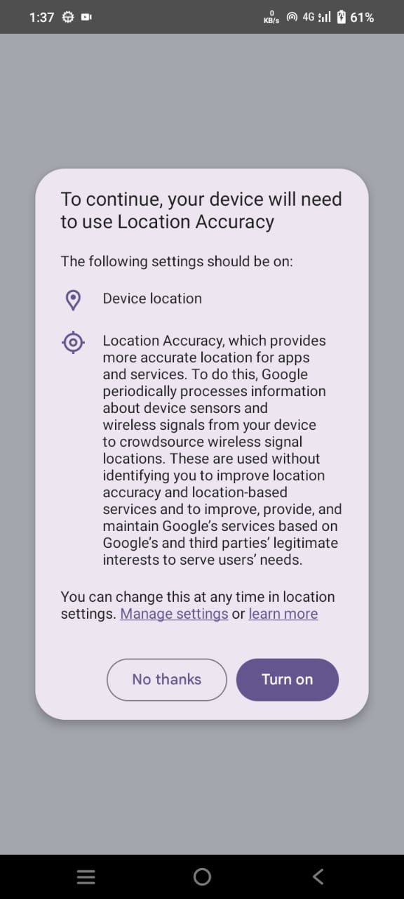
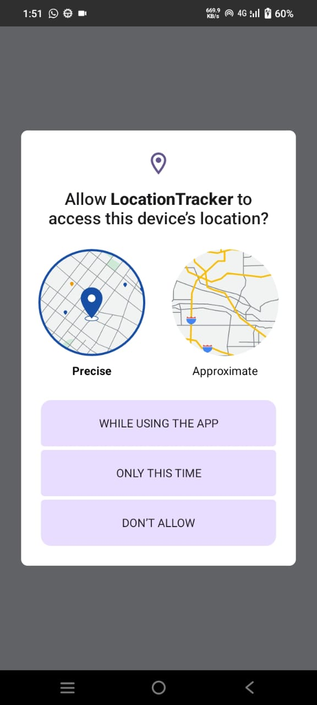
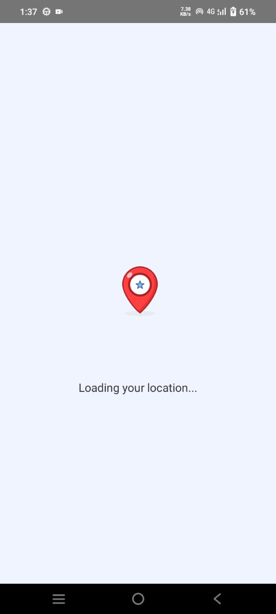
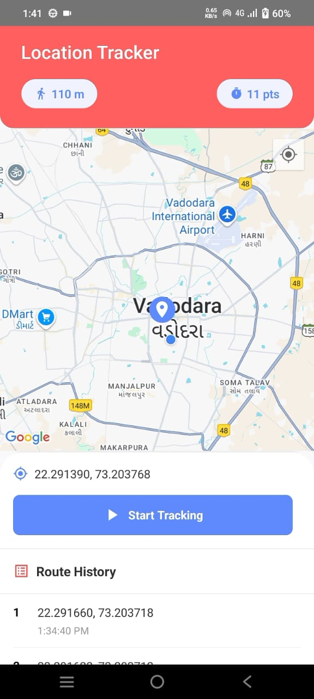
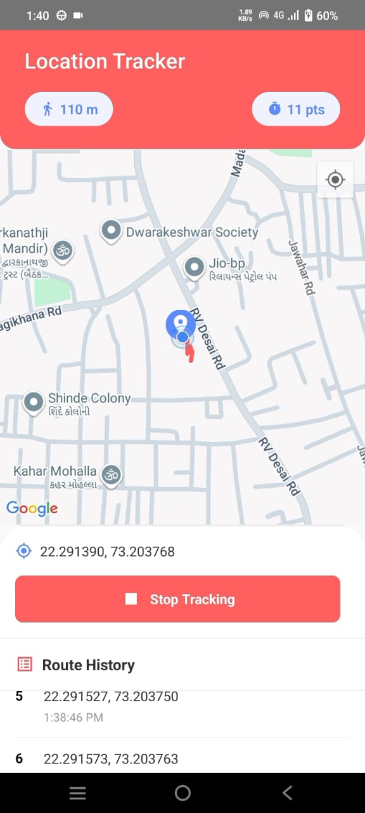
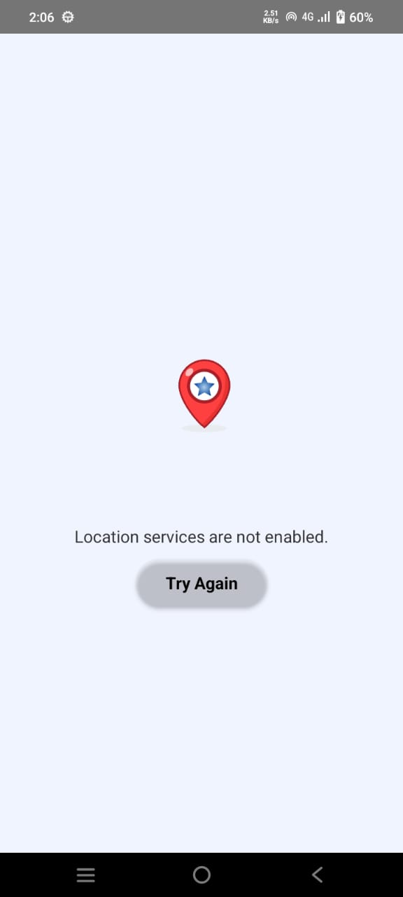

# React Native Real-Time Location Tracker

This React Native app tracks the user's real-time location, displays it on a Google Map, and draws the path traveled using a light pink polyline.

## Features
- Requests and handles location permissions (Android)
- Displays current location on a map using `react-native-maps`
- Continuously tracks location and updates it in real-time
- Draws the user's path with a light pink polyline
- Shows latitude and longitude coordinates
- Start/Stop tracking buttons
- Loading indicators and error handling with retry
- Saves and loads route history using AsyncStorage
- Clean and responsive UI using TypeScript

## 📷 Screenshots














## 🔧 Setup Instructions

1. **Clone the repository**
   ```bash
   git clone https://github.com/anjali67/LocationTracker.git
   cd LocationTracker


```bash
npm install
# or
yarn install
